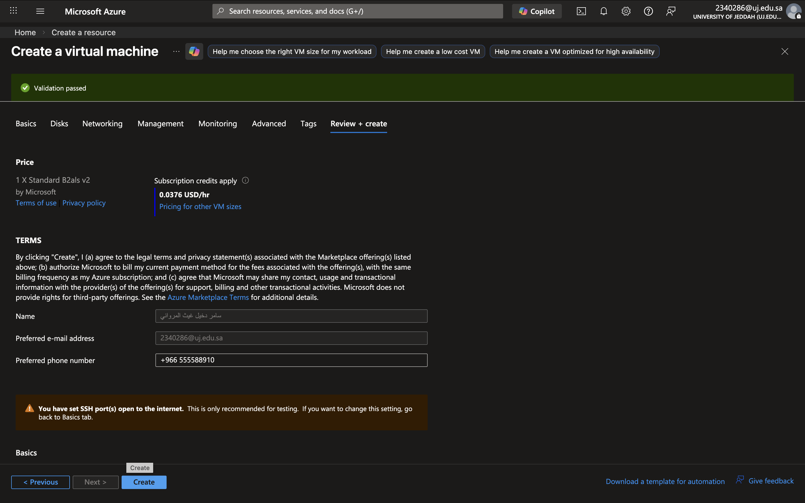
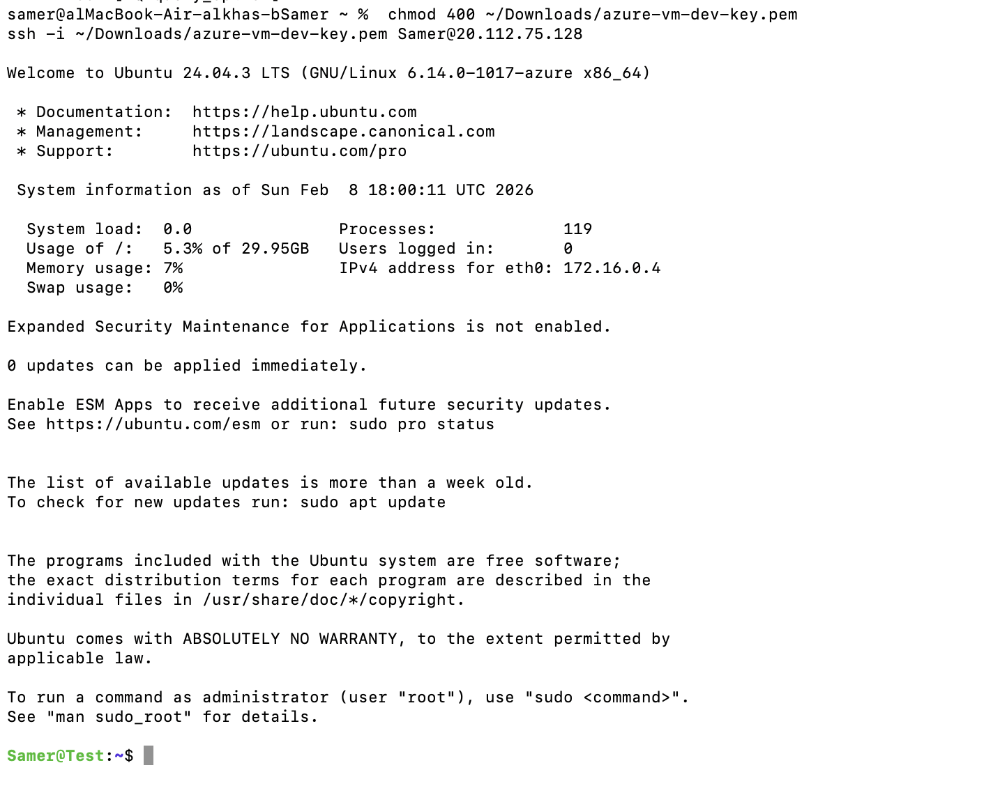
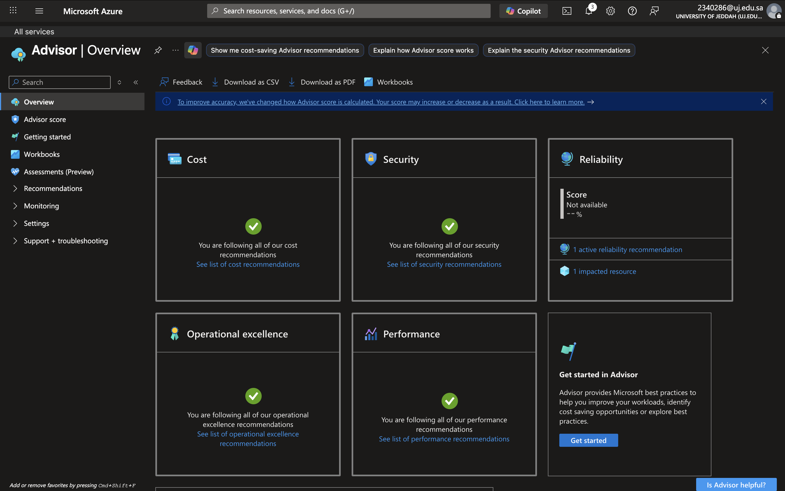
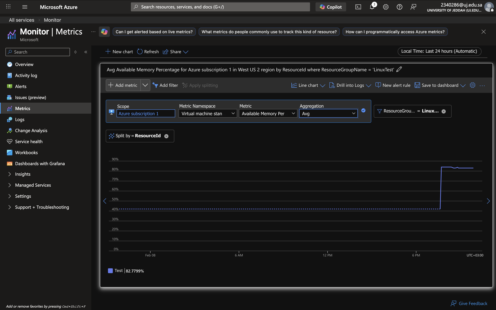
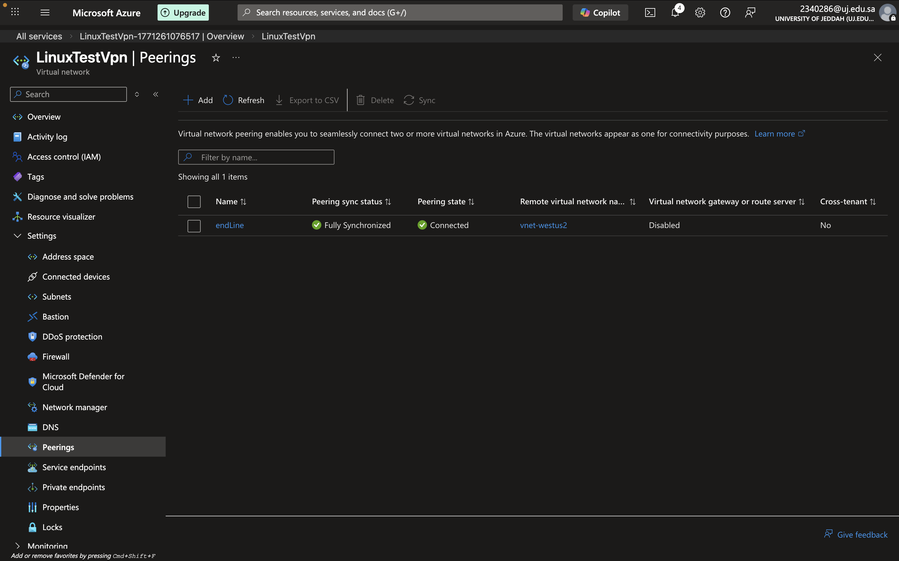
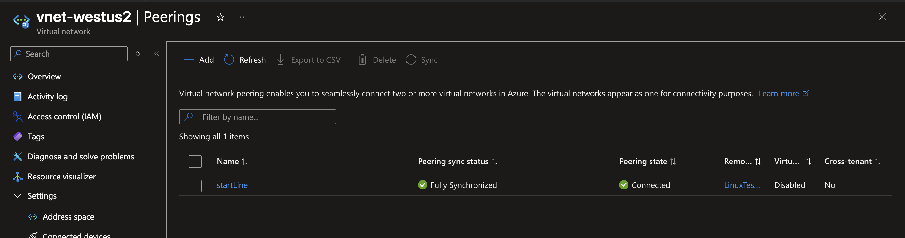
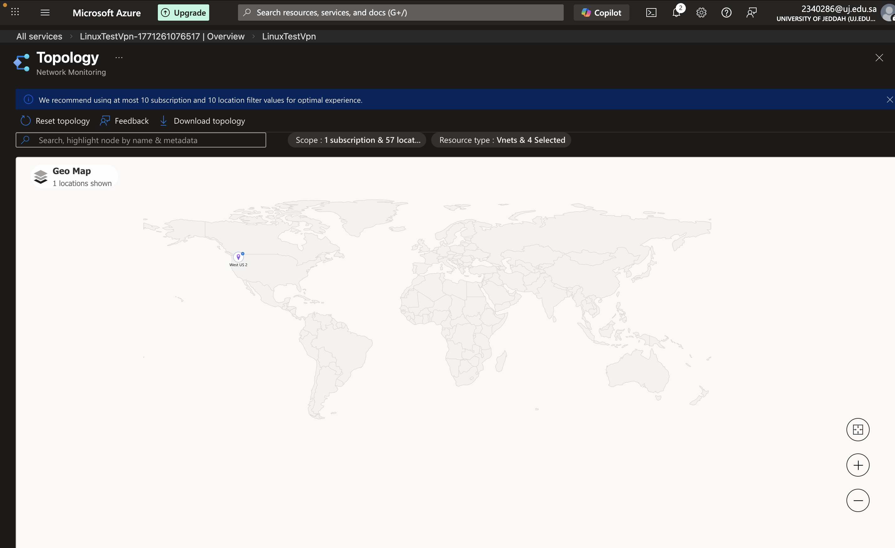

# Enterprise Multi-Tier Cloud Architecture & Infrastructure-as-Code (IaC)

# Project Overview
This repository showcases a production-grade enterprise deployment on **Microsoft Azure**. The infrastructure transitions legacy manual UI provisioning configurations into robust, repeatable **Infrastructure as Code (IaC)*templates using *Terraform**. 

The design implements strict network segmentation, secure remote administrative access, bidirectional global virtual private network interconnections, operational monitoring telemetry, and enforces cloud governance compliance best practices.

---

# Infrastructure Components & Architecture

This deployment consists of the following core engineering files:
*   `main.tf`: Defines the core cloud infrastructure topology, provider settings, and network perimeters.
*   `variables.tf`: Decouples hardcoded values to ensure a highly modular, reusable, and enterprise-ready codebase.

---

# Architecture Design & Deployment Validation

# 1. Infrastructure-as-Code Core Provisioning
The virtualized computing layer runs decoupled resource configurations inside dedicated, managed Resource Groups. The underlying topology is designed for high availability using enterprise-grade cloud load balancing components.

*Successful automated resource execution validation on the Azure provider portal:*

---

# 2. Linux Systems Administration & Cryptographic Access Control
Perimeter management is strictly restricted using asymmetric public-key cryptography. Remote administration applies secure local filesystem permission constraints (`chmod 400`) on the private key file (`.pem`) before establishing secure shell handshakes into the environment.

*Live secure SSH cryptographic verification from a local macOS terminal session into the running cloud server:*

---

### 3. Cloud Observability, Metrics Telemetry & Monitoring
Advanced operational visibility is established through centralized metric data collection endpoints. Real-time diagnostic performance indicators audit runtime compute characteristics, tracing infrastructure health through live telemetry graphs like available system memory percentages.

*Live telemetry chart tracing resource analytics metrics:*

---

# 4. Cloud Governance & Best Practices Alignment
The deployed topology aligns directly with standard cloud enterprise architecture frameworks, ensuring comprehensive optimization patterns across core design pillars: Security, Cost Management, Operational Excellence, and Reliability.

*Infrastructure optimization metrics verifying strict posture compliance:*

---

# Advanced Network Topologies & Global Peering Interconnects

# 5. Multi-VNet Interconnection (Bidirectional VNet Peering)
To facilitate low-latency, secure data transit across segregated business units without exposing internal endpoints to the public internet, a cross-network mesh topology is established. The routing architecture enforces explicit, bidirectional handshakes across distinct virtual networks.

*Inbound peering link orchestration status (LinuxTestVpn ➔ vnet-westus2):*

*Outbound return path verification status (vnet-westus2 ➔ LinuxTestVpn):*

---

# 6. Regional Topology Discovery & Network Mapping
Global infrastructure assets are discovered and tracked via distributed topological telemetry tools, validating geographic regional isolation rules within enterprise boundary perimeters.

*Regional topology map dashboard deployment visualization:*

